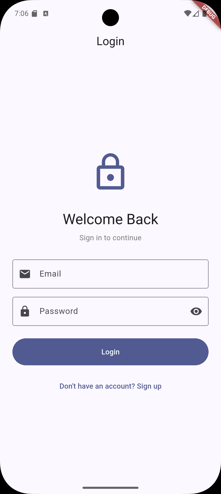
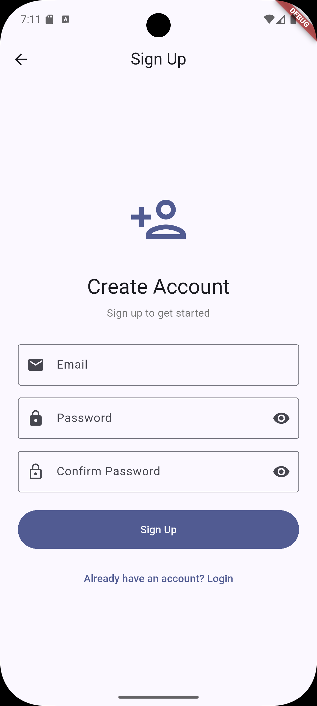
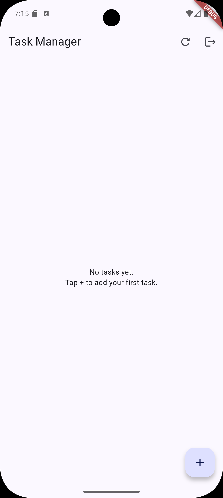
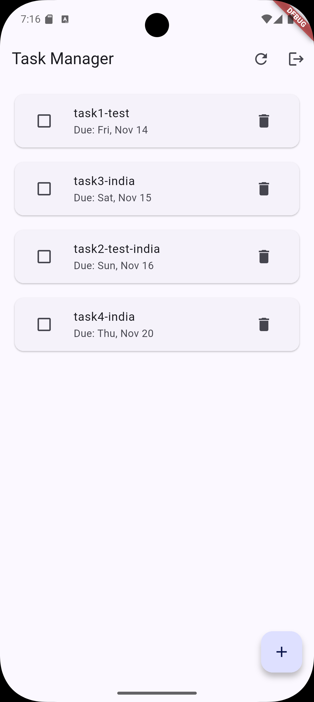
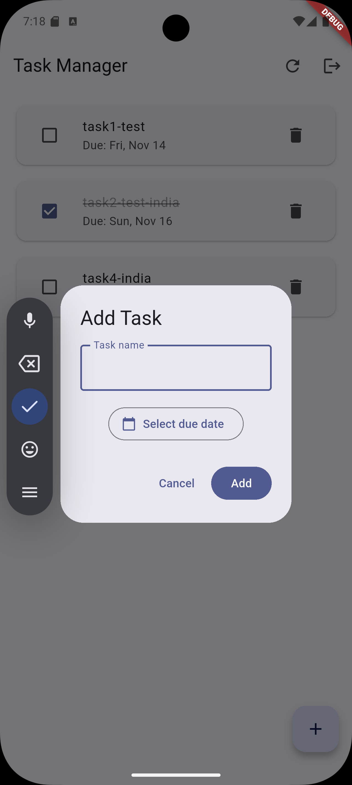
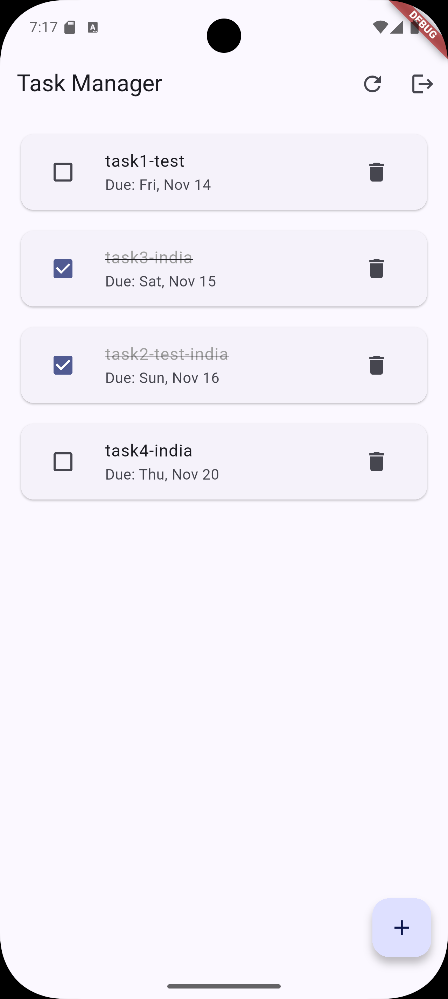
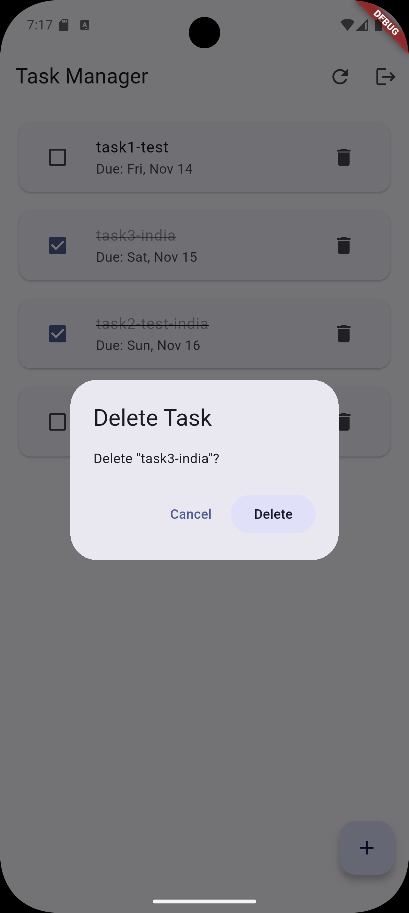

# Task Manager Application

A modern Flutter-based task management application with user authentication and full CRUD (Create, Read, Update, Delete) operations. Built with Material Design 3 and integrated with Parse Server (Back4App) for cloud-based data storage.


## Features

### 🔐 Authentication System
- **User Login**: Secure login with email and password validation
- **User Registration**: Sign up with email validation
- **Email Validation**: Supports `@student.com` and `@staff.com` email domains
- **Password Security**: Minimum 10 characters requirement
- **Password Visibility Toggle**: Show/hide password functionality
- **Session Persistence**: Automatic login status check on app launch
- **Secure Logout**: Confirmation dialog before logging out

### 📋 Task Management (CRUD Operations)

#### Create
- Add new tasks with custom titles
- Set due dates using an intuitive date picker
- Tasks automatically linked to the logged-in user

#### Read
- View all tasks in a clean, organized list
- Tasks sorted by due date (ascending order)
- Display task completion status
- Show formatted due dates

#### Update
- Toggle task completion status (mark as done/undone)
- Visual feedback for completed tasks (strikethrough text)
- Real-time UI updates

#### Delete
- Delete tasks with confirmation dialog
- Safe deletion with error handling

### 🎨 User Interface Features
- **Material Design 3**: Modern, beautiful UI with Material 3 components
- **Pull-to-Refresh**: Swipe down to refresh task list
- **Empty State**: Helpful message when no tasks exist
- **Loading Indicators**: Visual feedback during data operations
- **Error Handling**: User-friendly error messages with retry options
- **Responsive Design**: Works seamlessly across different screen sizes
- **Confirmation Dialogs**: Prevent accidental deletions and logouts

### ☁️ Backend Integration
- **Parse Server SDK**: Cloud-based backend using Back4App
- **User-Specific Data**: Each user sees only their own tasks
- **Real-time Sync**: Data synchronized with cloud storage
- **Offline Support**: Handles network errors gracefully

## Screenshots

### Login Screen


### Sign Up Screen


### Task List (Empty State)


### Task List (With Tasks)


### Add Task Dialog


### Task Completion


### Delete Confirmation


## Technology Stack

- **Framework**: Flutter (SDK ^3.9.2)
- **Backend**: Parse Server SDK Flutter (^8.0.0)
- **Cloud Service**: Back4App (Parse Server)
- **UI**: Material Design 3
- **Language**: Dart

## Prerequisites

- Flutter SDK (3.9.2 or higher)
- Dart SDK
- Android Studio / VS Code with Flutter extensions
- Back4App account (or Parse Server instance)

## Installation

1. **Clone the repository**
   ```bash
   git clone <repository-url>
   cd task_manager_assignment_crud
   ```

2. **Install dependencies**
   ```bash
   flutter pub get
   ```

3. **Configure Parse Server** (if needed)
   - The app is pre-configured with Back4App credentials
   - To use your own Parse Server, update the credentials in `lib/main.dart`:
     ```dart
     const keyApplicationId = 'YOUR_APPLICATION_ID';
     const keyClientKey = 'YOUR_CLIENT_KEY';
     const keyParseServerUrl = "YOUR_PARSE_SERVER_URL";
     ```

4. **Run the application**
   ```bash
   flutter run
   ```

## Usage

### Getting Started

1. **Sign Up**: Create a new account using an email ending with `@student.com` or `@staff.com`
2. **Login**: Use your credentials to log in to the application
3. **Add Tasks**: Tap the `+` button to create a new task
4. **Manage Tasks**: 
   - Check the checkbox to mark tasks as completed
   - Tap the delete icon to remove tasks
   - Pull down to refresh the task list

### Creating a Task

1. Tap the floating action button (`+`) in the bottom right corner
2. Enter a task title
3. Select a due date using the date picker
4. Tap "Add" to create the task

### Managing Tasks

- **Mark as Complete**: Tap the checkbox next to a task
- **Delete Task**: Tap the delete icon and confirm the deletion
- **Refresh**: Pull down on the task list or tap the refresh icon in the app bar

### Logging Out

1. Tap the logout icon in the app bar
2. Confirm the logout action
3. You will be redirected to the login screen

## Project Structure

```
lib/
  └── main.dart          # Main application file with all screens and logic
```

## Key Components

- `AuthWrapper`: Manages authentication state and routing
- `LoginScreen`: User login interface
- `SignupScreen`: User registration interface
- `TaskManagerScreen`: Main task management interface
- `Task`: Data model for tasks

## Features in Detail

### Email Validation
- Only accepts emails ending with `@student.com` or `@staff.com`
- Real-time validation feedback

### Password Requirements
- Minimum 10 characters
- Password visibility toggle for better UX

### Task Features
- **Title**: Custom task description
- **Due Date**: Date picker with range validation (1 year past to 5 years future)
- **Completion Status**: Boolean flag for task completion
- **User Association**: Each task is linked to the creating user

### Error Handling
- Network error handling with retry options
- User-friendly error messages
- Graceful degradation for offline scenarios

## Future Enhancements

Potential features for future versions:
- Task categories/priorities
- Task search and filtering
- Task editing (modify title and due date)
- Notifications for upcoming due dates
- Task sharing between users
- Dark mode support

## Contributing

Contributions are welcome! Please feel free to submit a Pull Request.

## License

This project is part of a course assignment.

## Author

**P L S Phani Teja**  
Student ID: 2024tm93573

---

**Note**: This application is built as part of a CRUD assignment demonstrating Create, Read, Update, and Delete operations with user authentication.
